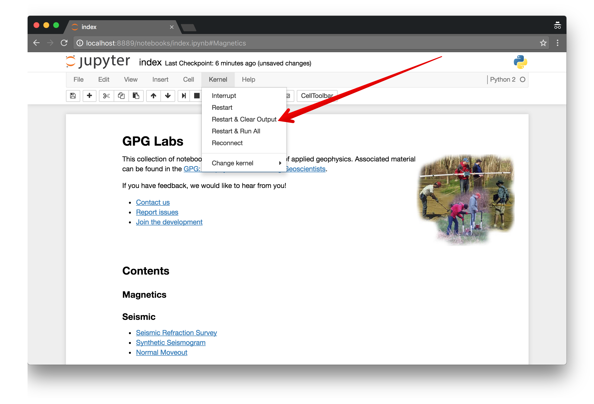
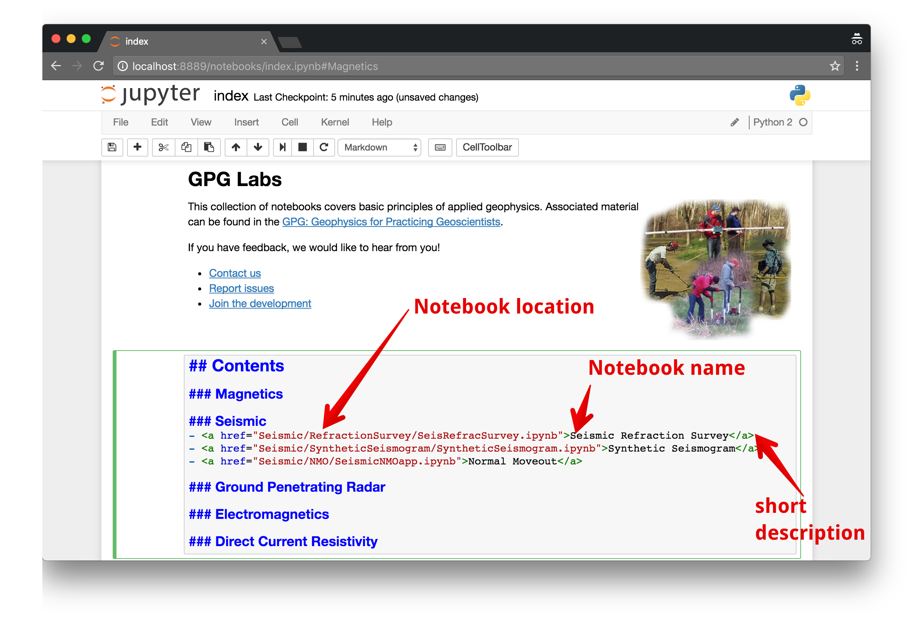

# gpgLabs
Tutorials and examples for applied geophysics!

These notebooks supplement material in the [gpg](http://gpg.geosci.xyz) and are used in the applied geophysics course [EOSC 350](http://eosc350.geosci.xyz) at UBC.

## Notes for Contributors

- Please "restart and clear all output" when committing notebooks. This ensures users start with a clean notebook.
  

- For new notebooks, please add a link to [index.ipynb](https://github.com/ubcgif/gpgLabs/blob/master/index.ipynb)
  

- All notebooks committed to this repository are tested on [TravisCI](https://travis-ci.org/ubcgif/gpgLabs). If dependencies need to be updated, they can be added to [requirements.txt](https://github.com/ubcgif/gpgLabs/blob/master/requirements.txt)

- To update the notebooks hosted on [binders](http://mybinder.org:/repo/ubcgif/gpgLabs), go to [mybinder.org](http://mybinder.org) and enter "https://github.com/ubcgif/gpgLabs" in the **Build a repository** field.
