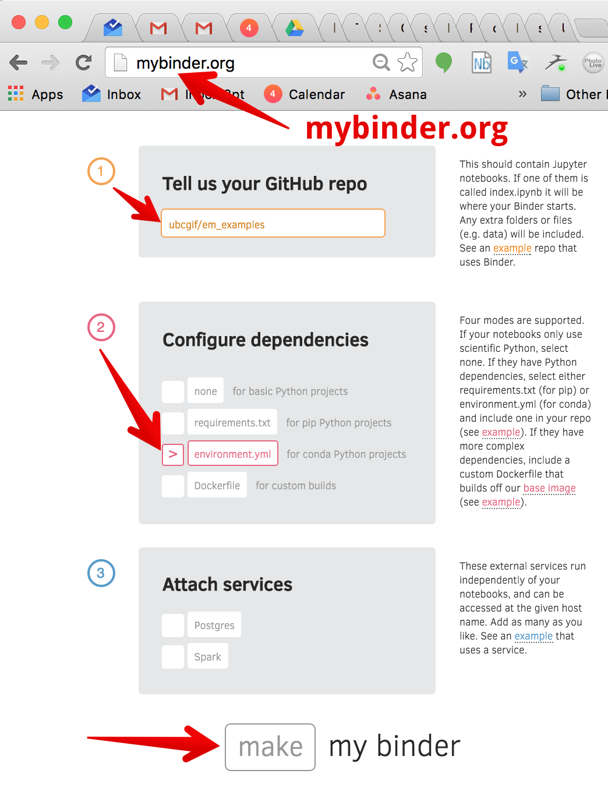

# em_apps

[](http://mybinder.org/repo/geoscixyz/em_apps)
[](https://travis-ci.org/geoscixyz/em_apps)

This is a repo of notebooks and interactive examples for http://em.geosci.xyz. The examples are based on code available in
[em_examples](http://github.com/geoscixyz/em_examples) and are hosted on [Azure Notebooks](https://notebooks.azure.com/library/em_apps), where they can be run on the cloud. Numerical simulations are based on [SimPEG](http://simpeg.xyz)

## Notebook Structure

Each notebook has the following structure

- **Purpose** : Motivation and key concepts addressed by the notebook
- **Setup** : Overview of the relevant parameters in the problem
- **Questions** : Guiding questions related to the purpose
- **App** : interactive visualizations
- **Explore** : further questions that can be explored with the app

## Conventions

For colormaps (http://matplotlib.org/examples/color/colormaps_reference.html)
- **fields** are plotted with the `viridis`
- **potentials** are plotted with `viridis`
- **sensitivities** are plotted with `viridis`
- **physical properties** are plotted with `jet`
- **charges** are plotted with `RdBu`

Order of widgets:
- geometry of survey
- geomerty target
- physical properties of target
- view options

## For developers
- to develop code for these notebooks, please see http://github.com/geoscixyz/em_examples
- when you generate a new notebook, please make sure that the filepath to its location follows the same structure as in [EM GeoSci](http://em.geosci.xyz)
- add the notebook name and path to theindex (index.ipynb)
- and update the [binder](http://mybinder.org) so it can be shared with the world!




## In EM GeoSci

To add the binder badge to an rst file, include:

```
.. image:: http://mybinder.org/badge.svg :target: http://mybinder.org/repo/geoscixyz/em_apps
```

and if you would like to point directly to a specific example, append the path to the url, ie.

```
.. image:: http://mybinder.org/badge.svg :target: http://mybinder.org/repo/geoscixyz/em_apps/notebooks/geophysical_surveys/DCR_Pseudo-section_Simulation.ipynb
```
